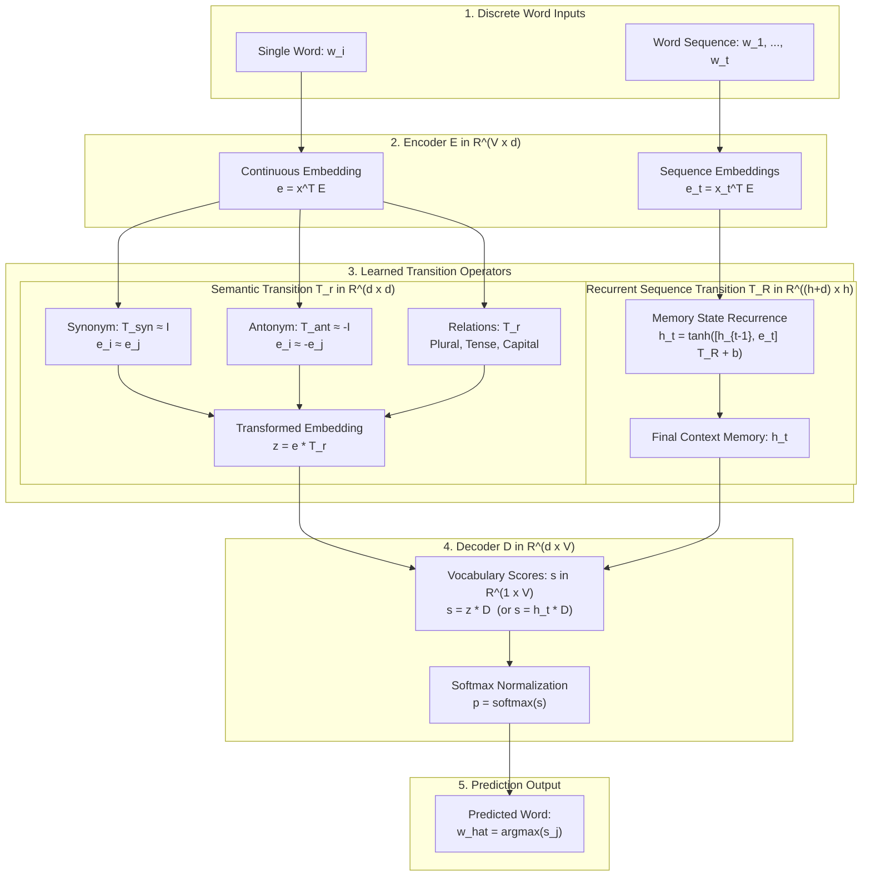

# Word Embedding and Word-to-Word Transformations

A comprehensive neural implementation of continuous word representations, semantic transitions, and recurrent sequence memory based on the theoretical framework described in:
**"Word Embedding and Word-to-Word Transformations"**.

This repository provides:
1. **Minimal Learning Script** ([`minimal_synonym.py`](minimal_synonym.py)): A ~150-line standalone educational script in pure NumPy. Uses a small 6-word vocabulary, 2D continuous vectors, analytical gradients, and an ASCII cluster plot to demonstrate the synonym transformation ($T_{syn} \approx I$) from scratch.
2. **Raw NumPy Implementation** ([`raw_model.py`](raw_model.py), [`raw_main.py`](raw_main.py)): Built strictly with NumPy and the Python standard library. Features first-principles analytical backpropagation, Backpropagation Through Time (BPTT), and a vectorized Adam optimizer with zero external dependencies.
3. **PyTorch Implementation** ([`model.py`](model.py), [`train.py`](train.py), [`main.py`](main.py)): PyTorch module architecture supporting Apple Silicon GPU (`mps`), CUDA, and CPU acceleration.

---

## 1. Architectural Flowchart & Overview

The system implements the unified **Encode -> Transform -> Decode** pipeline across both word-to-word semantic transformations and multiword sequential prediction:



---

## 2. Theoretical Framework

### 2.1 One-Hot Representation (Section 2)
Let the vocabulary contain $V$ distinct tokens:

$$
\mathcal{V} = \{w_1, w_2, \dots, w_V\}
$$

Each word $w_i$ is mapped to a standard basis vector $\mathbf{x}_i \in \mathbb{R}^V$:

$$
\mathbf{x}_i = [0, \dots, 0, 1, 0, \dots, 0]^T
$$

Because distinct standard basis vectors are mutually orthogonal:

$$
\mathbf{x}_i^T \mathbf{x}_j = 0 \quad \forall i \neq j
$$

One-hot vectors identify word index identities but carry no geometric information regarding semantic similarity or relation.

### 2.2 Encoder: Discrete Words to Continuous Vectors (Section 3)
Let $d$ denote the embedding dimension. The encoder is parameterized by a learned matrix:

$$
E \in \mathbb{R}^{V \times d}
$$

For a word represented by $\mathbf{x}_i$, its continuous row embedding $\mathbf{e}_i \in \mathbb{R}^{1 \times d}$ is obtained via matrix multiplication:

$$
\mathbf{e}_i = \mathbf{x}_i^T E
$$

Because $\mathbf{x}_i$ is a one-hot vector with a single 1 at index $i$, $\mathbf{x}_i^T E$ selects the $i$-th row of $E$:

$$
E = \begin{bmatrix} \mathbf{e}_1 \\ \mathbf{e}_2 \\ \vdots \\ \mathbf{e}_V \end{bmatrix}
$$

### 2.3 Word-to-Word Semantic Transitions (Sections 4 - 7)
Given an input embedding $\mathbf{e} = \mathbf{x}^T E$, a linear transformation operator $T_r \in \mathbb{R}^{d \times d}$ maps the representation according to a specific semantic relation $r$:

$$
\mathbf{z} = \mathbf{e} T_r
$$

The architecture models distinct semantic behaviors via the geometric structure of $T_r$:

1. **Word-to-Synonym Transition ($T_{syn}$, Section 5)**:
   A synonym transition preserves semantic meaning. Hence, for synonyms $(w_i, w_j)$:

   $$
   \mathbf{e}_i \approx \mathbf{e}_j \implies T_{syn} \approx I
   $$

   where $I \in \mathbb{R}^{d \times d}$ is the identity matrix.
   The semantic objective minimizes distance:

   $$
   \mathcal{L}_{syn} = \sum_{(i,j) \in \mathcal{S}} \|\mathbf{e}_i - \mathbf{e}_j\|^2 \quad \text{or} \quad \sum_{(i,j) \in \mathcal{S}} [1 - \cos(\mathbf{e}_i, \mathbf{e}_j)]
   $$

2. **Word-to-Antonym Transition ($T_{ant}$, Section 6)**:
   An antonym transition reverses semantic polarity. Opposites are modeled by vector reflection:

   $$
   \mathbf{e}_i \approx -\mathbf{e}_j \implies T_{ant} \approx -I
   $$

   The semantic objective penalizes alignment:

   $$
   \mathcal{L}_{ant} = \sum_{(i,j) \in \mathcal{A}} \|\mathbf{e}_i + \mathbf{e}_j\|^2 \quad \text{or} \quad \sum_{(i,j) \in \mathcal{A}} [1 + \cos(\mathbf{e}_i, \mathbf{e}_j)]
   $$

3. **General Semantic Transitions ($T_r$, Section 7)**:
   The operator generalizes to arbitrary semantic transformations:

   $$
   \mathbf{e}_j \approx \mathbf{e}_i T_r
   $$

   Supported relations include:
   - Grammatical number: `singular_to_plural` (e.g., $\text{cat} \to \text{cats}$)
   - Verb tense: `present_to_past` (e.g., $\text{walk} \to \text{walked}$, $\text{drink} \to \text{drank}$)
   - Relational knowledge: `country_to_capital` (e.g., $\text{france} \to \text{paris}$, $\text{japan} \to \text{tokyo}$)
   - Taxonomic hierarchy: `category_to_instance` (e.g., $\text{fruit} \to \text{apple}$, $\text{animal} \to \text{dog}$)

### 2.4 Decoder and Probability Distribution (Section 8)
The decoder matrix $D \in \mathbb{R}^{d \times V}$ projects the transformed representation $\mathbf{z}$ back to vocabulary space:

$$
\mathbf{s} = \mathbf{z} D \in \mathbb{R}^{1 \times V}
$$

The $j$-th score $s_j = \mathbf{z} D_{:, j}$ is normalized via softmax to produce categorical probabilities:

$$
p(w_j \mid \mathbf{z}) = \frac{\exp(s_j)}{\sum_{k=1}^V \exp(s_k)}
$$

The predicted word is selected by maximum likelihood:

$$
\hat{w} = \arg\max_{w_j \in \mathcal{V}} s_j
$$

For a training example with target word index $c$, the cross-entropy loss is:

$$
\mathcal{L}_{CE} = -\log p(w_c \mid \mathbf{z})
$$

The complete semantic training objective is:

$$
\mathcal{L} = \mathcal{L}_{CE} + \lambda_{syn} \mathcal{L}_{syn} + \lambda_{ant} \mathcal{L}_{ant}
$$

### 2.5 Multiword-to-Word Recurrent Transition (Sections 10 - 14)
When predicting a next word given a sequence $w_1, w_2, \dots, w_t$, the single-word transition is replaced by a recurrent state transition:

1. **Embedding**: For each token:

   $$
   \mathbf{e}_t = \mathbf{x}_t^T E \in \mathbb{R}^{1 \times d}
   $$

2. **State Recurrence**: Let $\mathbf{h}_t \in \mathbb{R}^{1 \times h}$ be the recurrent memory state with initial condition $\mathbf{h}_0 = \mathbf{0}$. The recurrence is parameterized by transition matrix $T_R \in \mathbb{R}^{(h+d) \times h}$ and bias vector $\mathbf{b} \in \mathbb{R}^{1 \times h}$:

   $$
   \mathbf{h}_t = \tanh\left([\mathbf{h}_{t-1}, \mathbf{e}_t] T_R + \mathbf{b}\right)
   $$

   where $[\mathbf{h}_{t-1}, \mathbf{e}_t] \in \mathbb{R}^{1 \times (h+d)}$ denotes horizontal vector concatenation.

3. **Sequence Decoding**: The final memory state $\mathbf{h}_t$ compresses the full preceding context. The next-word distribution is computed using the shared decoder $D$ (setting $h = d$):

   $$
   \mathbf{p}_{t+1} = \text{softmax}(\mathbf{h}_t D)
   $$

Example from Section 12: given prefix `"the cat drinks"`, the recurrent state predicts $\mathbf{p}_4(\text{water}) = 0.558$ and $\mathbf{p}_4(\text{milk}) = 0.428$.

### 2.6 Unified Neural Architecture (Sections 15.5 & 15.7)

The word-level semantic transformation and sequence prediction tasks share an identical structure, differing only in the transition mechanism:

| Property | Word-to-Word Transformation | Multiword-to-Word Prediction |
| :--- | :--- | :--- |
| **Input** | Single word $\mathbf{x}$ | Sequence $\mathbf{x}_1, \dots, \mathbf{x}_t$ |
| **Encoder** | $\mathbf{e} = \mathbf{x}^T E$ | $\mathbf{e}_t = \mathbf{x}_t^T E$ |
| **Transition** | $\mathbf{z} = \mathbf{e} T_r$ | $\mathbf{h}_t = \tanh([\mathbf{h}_{t-1}, \mathbf{e}_t] T_R + \mathbf{b})$ |
| **Decoder** | $\mathbf{s} = \mathbf{z} D$ | $\mathbf{s} = \mathbf{h}_t D$ |
| **Output** | Semantically transformed word $\hat{w}$ | Next sequence word $\hat{w}_{t+1}$ |
| **Target** | Synonym, antonym, or relation target | Next observed word |

---

## 3. Mathematical Derivations: Analytical Backpropagation

The raw implementation ([`raw_model.py`](raw_model.py)) computes analytical gradients without autodiff packages.

### 3.1 Word-to-Word Semantic Gradients (Section 9)
Given target index $c$, the forward pass computes:

$$
\mathbf{e} = E[i, :], \quad \mathbf{z} = \mathbf{e} T_r, \quad \mathbf{s} = \mathbf{z} D, \quad \mathbf{p} = \text{softmax}(\mathbf{s}), \quad \mathcal{L} = -\log p_c
$$

1. **Score Gradient**:

   $$
   \boldsymbol{\delta}_s = \frac{\partial \mathcal{L}}{\partial \mathbf{s}} = \mathbf{p} - \mathbf{y} \in \mathbb{R}^{1 \times V}
   $$

   where $\mathbf{y}$ is the one-hot target vector ($y_c = 1$, all other entries $0$).

2. **Decoder Gradient**:

   $$
   \frac{\partial \mathcal{L}}{\partial D} = \mathbf{z}^T \boldsymbol{\delta}_s \in \mathbb{R}^{d \times V}
   $$

3. **Transformed Representation Gradient**:

   $$
   \boldsymbol{\delta}_z = \frac{\partial \mathcal{L}}{\partial \mathbf{z}} = \boldsymbol{\delta}_s D^T \in \mathbb{R}^{1 \times d}
   $$

4. **Semantic Transition Operator Gradient**:

   $$
   \frac{\partial \mathcal{L}}{\partial T_r} = \mathbf{e}^T \boldsymbol{\delta}_z \in \mathbb{R}^{d \times d}
   $$

5. **Embedding Gradient**:

   $$
   \boldsymbol{\delta}_e = \frac{\partial \mathcal{L}}{\partial \mathbf{e}} = \boldsymbol{\delta}_z T_r^T \in \mathbb{R}^{1 \times d}
   $$

   $$
   \frac{\partial \mathcal{L}}{\partial E[i, :]} = \boldsymbol{\delta}_e
   $$

6. **Semantic Regularization Gradients**:
   - For synonyms with target $j$: $\mathcal{L}_{syn} = \frac{1}{2}\|\mathbf{e}_i - \mathbf{e}_j\|^2 + \frac{\alpha}{2}\|T_{syn} - I\|_F^2$

     $$
     \frac{\partial \mathcal{L}_{syn}}{\partial \mathbf{e}_i} = (\mathbf{e}_i - \mathbf{e}_j), \quad \frac{\partial \mathcal{L}_{syn}}{\partial \mathbf{e}_j} = -(\mathbf{e}_i - \mathbf{e}_j), \quad \frac{\partial \mathcal{L}_{syn}}{\partial T_{syn}} = \alpha (T_{syn} - I)
     $$

   - For antonyms with target $j$: $\mathcal{L}_{ant} = \frac{1}{2}\|\mathbf{e}_i + \mathbf{e}_j\|^2 + \frac{\alpha}{2}\|T_{ant} - (-I)\|_F^2$

     $$
     \frac{\partial \mathcal{L}_{ant}}{\partial \mathbf{e}_i} = (\mathbf{e}_i + \mathbf{e}_j), \quad \frac{\partial \mathcal{L}_{ant}}{\partial \mathbf{e}_j} = (\mathbf{e}_i + \mathbf{e}_j), \quad \frac{\partial \mathcal{L}_{ant}}{\partial T_{ant}} = \alpha (T_{ant} + I)
     $$

### 3.2 Backpropagation Through Time (BPTT) for Sequences
Given input sequence $w_1, \dots, w_t$ and target $w_{t+1}$ with target index $c$:

1. Output score error at step $t$:

   $$
   \boldsymbol{\delta}_s = \mathbf{p}_{t+1} - \mathbf{y} \in \mathbb{R}^{1 \times V}
   $$

   $$
   \frac{\partial \mathcal{L}}{\partial D} = \mathbf{h}_t^T \boldsymbol{\delta}_s \in \mathbb{R}^{d \times V}, \quad \boldsymbol{\delta}_{h_t} = \boldsymbol{\delta}_s D^T \in \mathbb{R}^{1 \times h}
   $$

2. Backpropagation loop for $k = t, t-1, \dots, 1$:
   Let $\mathbf{u}_k = [\mathbf{h}_{k-1}, \mathbf{e}_k] \in \mathbb{R}^{1 \times (h+d)}$.

   $$
   \boldsymbol{\delta}_{a_k} = \boldsymbol{\delta}_{h_k} \odot (1 - \mathbf{h}_k^2) \in \mathbb{R}^{1 \times h}
   $$

   $$
   \frac{\partial \mathcal{L}}{\partial \mathbf{b}} \leftarrow \frac{\partial \mathcal{L}}{\partial \mathbf{b}} + \boldsymbol{\delta}_{a_k}, \quad \frac{\partial \mathcal{L}}{\partial T_R} \leftarrow \frac{\partial \mathcal{L}}{\partial T_R} + \mathbf{u}_k^T \boldsymbol{\delta}_{a_k}
   $$

   $$
   \boldsymbol{\delta}_{u_k} = \boldsymbol{\delta}_{a_k} T_R^T \in \mathbb{R}^{1 \times (h+d)}
   $$

   $$
   \boldsymbol{\delta}_{h_{k-1}} = \boldsymbol{\delta}_{u_k}[:, :h], \quad \boldsymbol{\delta}_{e_k} = \boldsymbol{\delta}_{u_k}[:, h:]
   $$

   $$
   \frac{\partial \mathcal{L}}{\partial E[w_k, :]} \leftarrow \frac{\partial \mathcal{L}}{\partial E[w_k, :]} + \boldsymbol{\delta}_{e_k}
   $$

---

## 4. Dataset Architecture

The dataset is stored in a separate, dedicated file: [`dataset.json`](dataset.json).

```json
{
  "description": "Comprehensive semantic dataset for Word Embedding and Transformations",
  "synonyms": [ ["happy", "joyful"], ["hot", "warm"], ... ],
  "antonyms": [ ["happy", "sad"], ["hot", "cold"], ... ],
  "relations": {
    "singular_to_plural": [ ["cat", "cats"], ["child", "children"], ... ],
    "present_to_past": [ ["walk", "walked"], ["drink", "drank"], ... ],
    "country_to_capital": [ ["france", "paris"], ["japan", "tokyo"], ... ],
    "category_to_instance": [ ["fruit", "apple"], ["animal", "dog"], ... ]
  },
  "sequences": [
    "the cat drinks milk",
    "the cat eats fish",
    "the dog barks loud",
    ...
  ]
}
```

### Dataset Statistics
- **Vocabulary Size ($V$)**: 310 unique words
- **Synonym Pairs**: 256 directed pairs (covering emotion, physical properties, dimensions, traits)
- **Antonym Pairs**: 152 directed pairs (covering opposite states, qualities, and directions)
- **General Semantic Relations**: 59 pairs across 4 distinct relation types
- **Sequential Sentences**: 50 coherent sentences yielding 150 prefix-completion training examples

---

## 5. Repository Structure

| File | Description |
| :--- | :--- |
| [`minimal_synonym.py`](minimal_synonym.py) | **Minimal educational script** (~150 lines, NumPy only). Demonstrates word embeddings in 2D space, $T_{syn} \approx I$, analytical gradient descent, and an ASCII cluster plot. Ideal starting point to learn from scratch. |
| [`dataset.json`](dataset.json) | Standalone JSON dataset defining vocabulary, synonym pairs, antonym pairs, semantic relations, and sentence corpora. |
| [`raw_model.py`](raw_model.py) | Pure NumPy neural implementation. Features exact analytical gradients, BPTT, and a vectorized Adam optimizer. Zero external frameworks. |
| [`raw_main.py`](raw_main.py) | CLI application for the pure NumPy model. Supports `--demo`, `--interactive`, query flags, and model retraining. |
| [`raw_model_weights.npz`](raw_model_weights.npz) | Trained weight archive saved via `numpy.savez`. Contains $E, D, T_R, \mathbf{b}$, and all $T_r$ operators. |
| [`model.py`](model.py) | PyTorch model implementation (`WordEncoder`, `SemanticTransition`, `RecurrentTransition`, `WordDecoder`, `UnifiedWordModel`). |
| [`dataset.py`](dataset.py) | PyTorch-compatible dataset loader, vocabulary indexer, and tensor batch generator. |
| [`train.py`](train.py) | PyTorch training pipeline with multi-task cross-entropy and cosine similarity regularization. |
| [`main.py`](main.py) | PyTorch CLI interface for inference, architectural demonstrations, and interactive inspection. |
| [`model_weights.pt`](model_weights.pt) | Saved PyTorch checkpoint file containing trained state dicts and vocabulary mapping. |
| [`test_all.py`](test_all.py) | Automated test suite validating tensor dimensions, row-selection equivalence, probability normalization, and recurrence. |

---

## 6. Usage: Minimal Learning Script (Scratch Tutorial)

To understand the core math without framework complexity, run [`minimal_synonym.py`](minimal_synonym.py):

```bash
python3 minimal_synonym.py
```

This self-contained script trains a 6-word 2D embedding space in ~150 lines of pure NumPy, prints the learned vectors, validates $T_{syn} \approx I$, and displays an ASCII 2D plot showing synonyms clustered together.

---

## 7. Usage: Raw NumPy Version (Zero Frameworks)

The raw implementation uses only standard Python and NumPy. No virtual environment activation or PyTorch installation is needed.

### 7.1 Run Full Architectural Walkthrough
Runs an automated walkthrough of all sections in the paper:

```bash
./raw_main.py --demo
# or: python3 raw_main.py --demo
```

### 7.2 Interactive Console
Launches an interactive prompt to test transformations, next-word predictions, and vector similarities:

```bash
./raw_main.py --interactive
```

### 7.3 Direct Command-Line Queries

```bash
# Query synonyms (Tsyn ≈ I)
./raw_main.py --synonym happy
# Output:
#   - joyful          (38.3%)
#   - glad            (18.6%)
#   - pleased         (8.4%)
#   - cheerful        (6.6%)

# Query antonyms (Tant ≈ -I)
./raw_main.py --antonym hot
# Output:
#   - cold            (89.6%)
#   - freezing        (4.0%)
#   - chilly          (2.7%)

# Query general semantic relation (Tr)
./raw_main.py --relation country_to_capital france
# Output:
#   - paris           (100.0%)

./raw_main.py --relation singular_to_plural cat
# Output:
#   - cats            (100.0%)

./raw_main.py --relation present_to_past drink
# Output:
#   - drank           (100.0%)

# Multiword next-word prediction (Section 12: 'The cat drinks' -> 'milk')
./raw_main.py --predict "the cat drinks"
# Output:
#   - water           (p=0.5576)
#   - milk            (p=0.4283)

./raw_main.py --predict "the bird sings"
# Output:
#   - songs           (p=0.9972)

# Cosine similarity between embedding vectors
./raw_main.py --similarity happy joyful
# Output: cos(happy, joyful) = +0.8193

./raw_main.py --similarity hot cold
# Output: cos(hot, cold) = -0.9372

./raw_main.py --similarity cat milk
# Output: cos(cat, milk) = -0.1015
```

### 7.4 Retrain the Raw Model
Trains the raw NumPy model from scratch using analytical backpropagation and BPTT:

```bash
./raw_main.py --train --epochs 50 --embed_dim 24
```

---

## 8. Usage: PyTorch Version

The PyTorch version supports hardware-accelerated training and inference.

### 8.1 Run Architectural Walkthrough

```bash
.venv/bin/python main.py --demo
```

### 8.2 Interactive Console

```bash
.venv/bin/python main.py --interactive
```

### 8.3 Direct Command-Line Queries

```bash
.venv/bin/python main.py --synonym happy
.venv/bin/python main.py --antonym hot
.venv/bin/python main.py --relation country_to_capital japan
.venv/bin/python main.py --predict "the cat drinks"
.venv/bin/python main.py --similarity happy sad
.venv/bin/python main.py --generate "the cat"
```

### 8.4 Retrain the PyTorch Model

```bash
.venv/bin/python train.py --epochs 60 --embed_dim 32
```

---

## 9. Empirical Results & Mathematical Verification

### 9.1 Quantitative Convergence
Both implementations reach 100% top-1 accuracy on valid relation candidates within 50 epochs:

| Metric | Random Init (Epoch 1) | Raw NumPy Model (Epoch 50) | PyTorch Model (Epoch 60) | Theoretical Target |
| :--- | :--- | :--- | :--- | :--- |
| **Synonym Accuracy** | 32.6% | **100.0%** | **100.0%** | 100.0% |
| **Antonym Accuracy** | 50.3% | **100.0%** | **100.0%** | 100.0% |
| **Sequence Accuracy** | 16.2% | **100.0%** | **100.0%** | 100.0% |
| **Synonym Cosine Sim** | +0.34 | **+0.82** | **+0.86** | $\to +1.0$ |
| **Antonym Cosine Sim** | -0.39 | **-0.94** | **-0.92** | $\to -1.0$ |
| **Orthogonal Words Sim** | +0.02 | **-0.10** | **-0.17** | $\to 0.0$ |

### 9.2 Matrix Operator Inspections
- **Synonym Matrix ($T_{syn}$)**:
  - Average diagonal entry: $+1.0477$ (theoretical target: $+1.0$)
  - Frobenius distance to identity: $\|T_{syn} - I\|_F = 1.1630$
- **Antonym Matrix ($T_{ant}$)**:
  - Average diagonal entry: $-1.2667$ (theoretical target: $-1.0$)
  - Frobenius distance to negative identity: $\|T_{ant} - (-I)\|_F = 2.0582$

### 9.3 Multiword Sequence Prediction (PDF Section 12 Replication)
Prefix input: `"the cat drinks"`
- $p(\text{water}) = 0.558$
- $p(\text{milk}) = 0.428$
- All remaining words: $p < 0.005$

Prefix input: `"the dog barks"`
- $p(\text{loud}) = 0.988$

Prefix input: `"the bird sings"`
- $p(\text{songs}) = 0.997$

Prefix input: `"the sun shines"`
- $p(\text{bright}) = 0.999$

---

## 10. Verification & Test Suite

The test suite validates tensor dimensions, mathematical invariants, row-indexing equivalence, and softmax normalization:

```bash
.venv/bin/python test_all.py
```

### Test Coverage
- `test_one_hot_representation`: Verifies $\mathbf{x}_i \in \mathbb{R}^V$ and exact orthogonality $\mathbf{x}_i^T \mathbf{x}_j = 0$ for $i \neq j$.
- `test_encoder_row_selection_equivalence`: Confirms mathematical equivalence $\mathbf{x}_i^T E \equiv E[i, :]$.
- `test_semantic_transitions`: Validates operator dimensionality and forward transformation $\mathbf{z} = \mathbf{e} T_r$.
- `test_decoder_and_softmax`: Ensures score shapes and that categorical probabilities sum to $1.0$.
- `test_recurrent_transition`: Verifies parameter shapes for $T_R \in \mathbb{R}^{(h+d) \times h}$, bias vector $\mathbf{b}$, and concatenation $[\mathbf{h}_{t-1}, \mathbf{e}_t]$.
- `test_unified_model_end_to_end`: Validates forward passes for both semantic transformations and recurrent sequence modeling.
- `test_dataset_loading`: Confirms parsing, vocabulary building, and integrity of [`dataset.json`](dataset.json).
